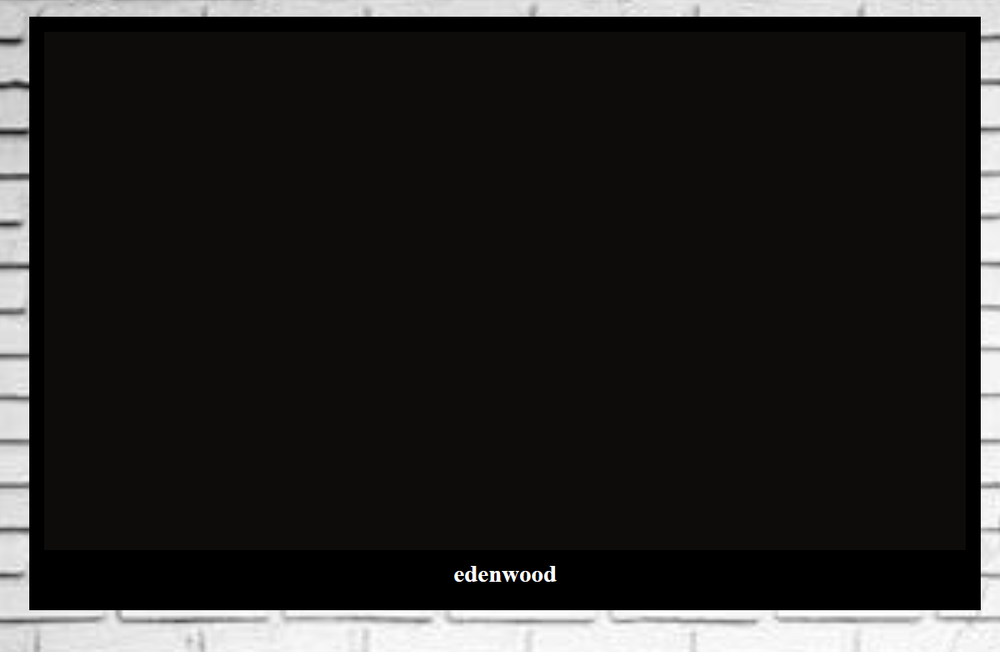
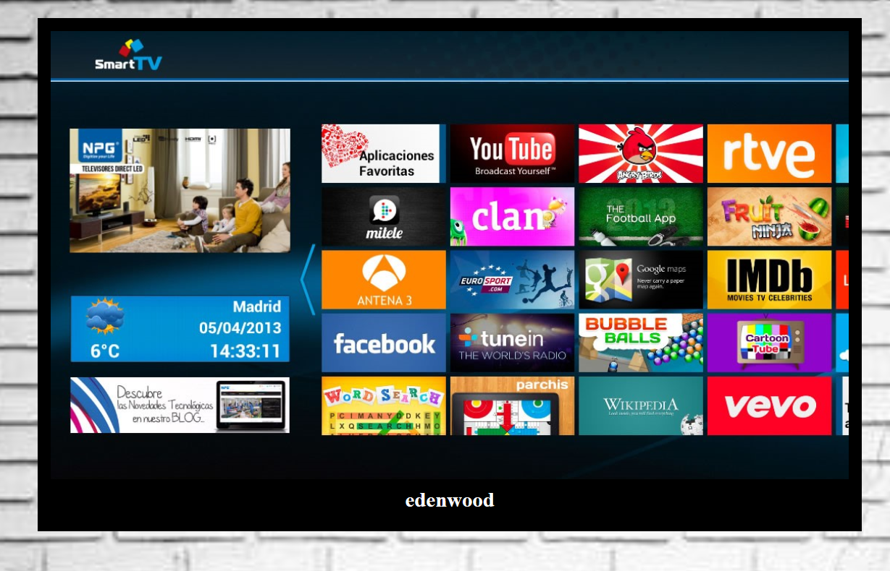
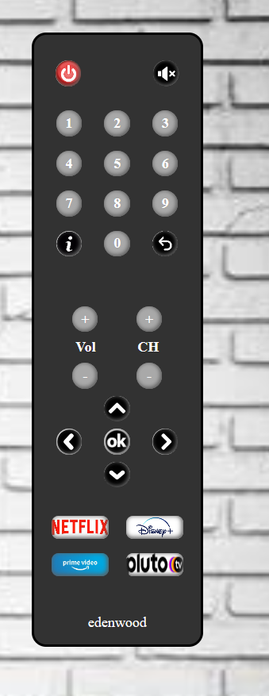
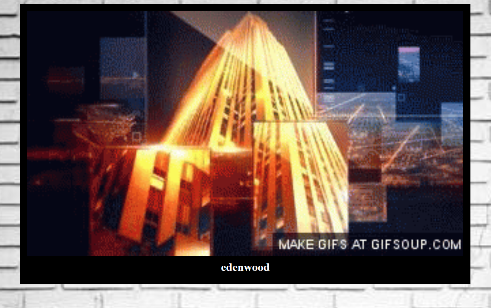
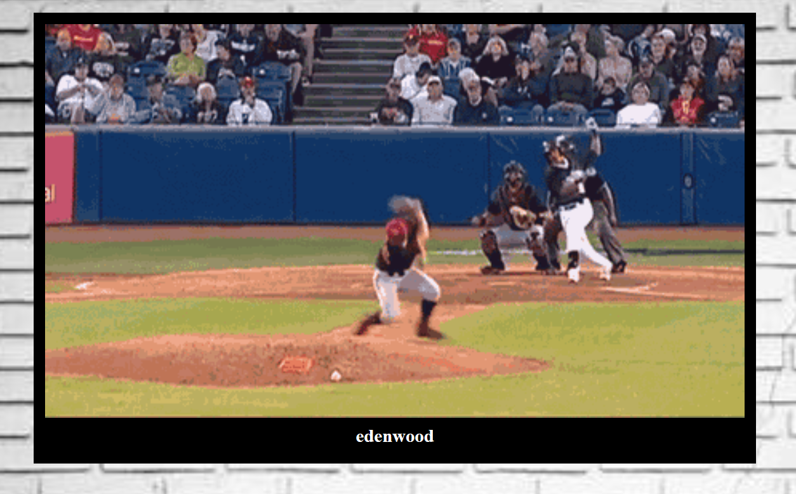

#   Tv Interactiva 

Este proyecto tiene como objetivo diseñar una interfaz de Tv interactiva, aplicando los conocimientos adquiridos en HTML5, CSS3 y JavaScript. El diseño constará de una pantalla con un control remoto y su funcionalidad será que simulen la interacción con una televisión real.

## 📑 Descripción del Proyecto 📑

El proyecto tendra los siguiente: 

- Una pantalla de inicio que simule la interfaz de bienvenida.

- Un mando a distancia virtual con la inclusión de cambiar de canales, ajustar volumen y funciones adicionale.

- Cambiar dinámicamente la informacion del canal con la imagen de fondo 

## ⌨️ Tecnologías Utilizadas ⌨️

Para el desarrollo del proyecto se utilizarán las siguientes tecnologías:
-  : Para la estructura y el contenido de la página.

-  : Para el diseño y la presentación visual de la página.
- [![JavaScript]](https://img.shields.io/badge/-JavaScript-black?style=flat&logo=javascript) :Para la parte dinamica del proyecto.

## Funciones

- Funcionalidad de encendido y apagado con el botón .
- visualización de la hora, fecha y nombre de cada canal.
- Los botones con numeros cambian los canales mostrando un fondo diferente.
-Se puede cambiar de canales con el + CH -.

## Cosas por realizar

-La funcionalidad del volumen.
- La funcionalidad del mute.

## DEMO

[Interaccion con la Tv ]

## Autor

* Astrid Viloria 
* [GitHub] (https://github.com/Astridvilpa)